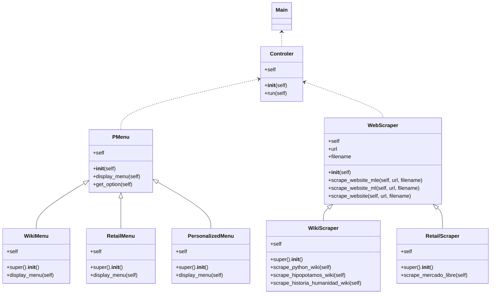

# Proyecto Final POO (Webscraping) // Diego Arévalo

## `1. Analisis del problema`

Se propuso construir una aplicación que emule un un sistema de webs crapping utilizando Python, por lo cual vamos a iniciar hablando acerca de algunas bibliotecas que serán necesarias para hacer peticiones a las páginas web que querramos scrapear.
Lo que se buscará hacer es mediante estas bibliotecas y algo de conocimiento de HTML, una vez proporcionado un link, analizar el código fuente de la página para utilizar los identificadores de HTML para requerir todos aquellos objetos con esa misma identificación.

### *`Biblioteca "requests":`*
Es una biblioteca de software libre que permite realizar solicitudes HTTP de manera sencilla y eficiente. Con esta biblioteca, puedes enviar solicitudes a servidores web y recibir respuestas. Es ampliamente utilizada en el desarrollo web y en tareas de scraping (extracción de datos de sitios web), así como en aplicaciones que requieren comunicación con servidores a través de HTTP. 

Para utilizar la biblioteca "requests", primero debes instalarla mediante pip, el gestor de paquetes de Python, utilizando el siguiente comando en tu terminal:

```python
pip install requests
```

Una vez instalada, puedes comenzar a utilizarla en tu código Python importándola de la siguiente manera:

```python
import requests
```
A partir de ahí, podremos utilizar las funciones y métodos proporcionados por la biblioteca "requests" para interactuar con servidores web de manera fácil y efectiva.

### *`Biblioteca "bs4":`* 
La librería bs4 en Python se refiere a Beautiful Soup 4, que es una biblioteca de análisis HTML y XML. Es una herramienta útil para extraer información de páginas web y manipular datos en formatos HTML y XML de una manera sencilla y eficiente. La biblioteca bs4 es popular entre los desarrolladores web y los científicos de datos que necesitan extraer datos de páginas web para análisis y procesamiento posterior. Es una herramienta flexible y poderosa que facilita el trabajo con datos web en Python.

Para utilizar la biblioteca "bs4", primero debes instalarla mediante pip, el gestor de paquetes de Python, utilizando el siguiente comando en tu terminal:

```python
pip install beautifulsoup4
```

Una vez instalada, puedes comenzar a utilizarla en tu código Python importándola de la siguiente manera ya que utilizaremos una libreria dentro de esta biblioteca:

```python
from bs4 import BeautifulSoup
```

Además de instalar la librería, es posible que también necesites instalar un analizador HTML para que Beautiful Soup pueda analizar el código HTML, el cual se instala de la siguinete manera: 

```python
pip install lxml
```

## `2. Manejo del problema`
Una vez que hayamos instalado estas bibliotecas crearemos una carpeta llamda "Proyecto_Final_POO" la cual alojará todos nuestros archivos y estará compuesta de la siguiente manera:

```
/Proyecto_Final_POO/
├── paquete/
│   ├── __init__.py
│   ├── Controller.py
│   ├── PersonalizedMenu.py
│   ├── PMenu.py
│   ├── RetailMenu.py
│   ├── RetailScraper.py
│   ├── WebScraper.py
│   ├── WikiMenu.py
│   └── WikiScraper.py
└── main.py
```

La carperta paquete contiene algunos módulos que a su vez contienen clases, las cuales heredad algunos atributos de estos mismo módulos, lo cual se representa de mejor manera en el siguiente diagrama UML: 


El contenido y la función de cada módulo son los siguientes: 

### *`__init__.py`*
El archivo __init__.py en un módulo de Python es un archivo especial que se utiliza para indicar que el directorio que lo contiene debe ser tratado como un paquete. Estos archivos también pueden contener código Python que se ejecutará cuando el paquete sea importado por primera vez. En este caso el archivo se encuentra vacío.

### *`main.py`*
Este archivo se utiliza para inicializar y ejecutar una instancia del módulo Controller, el cual controla la ejecución del programa de web scraping.

```python
from Paquete.Controller import * # Importamos la clase Controller del archivo Controller.py

controller = Controller() # Instancia de la clase Controller
controller.run() # Llama al método run de la clase Controller
```

### *`Controller.py`*
Este archivo se encarga de importar todos los demás módulos y empaquetarlos para facilitar la interacción del usuario con el archivo main.py.

```python
from Paquete.PMenu import * # Importamos la clase Menu del archivo PMenu.py
from Paquete.WikiScraper import * # Importamos la clase WikiScraper del archivo WikiScraper.py
from Paquete.RetailScraper import * # Importamos la clase RetailScraper del archivo RetailScraper.py
from Paquete.WikiMenu import * # Importamos la clase WikiMenu del archivo WikiMenu.py
from Paquete.RetailMenu import * # Importamos la clase RetailMenu del archivo RetailMenu.py
from Paquete.PersonalizedMenu import * # Importamos la clase PersonalizedMenu del archivo PersonalizedMenu.py


class Controller: # Clase para controlar el flujo de la aplicación
    def __init__(self): # Constructor de la clase
        self.wiki_scraper = WikiScraper() 
        self.retail_scraper = RetailScraper() 

    def run(self): # Método para ejecutar la aplicación
        menu = Menu() 
        wiki_menu = WikiMenu() 
        retail_menu = RetailMenu()
        personalized_menu = PersonalizedMenu()

        while True: # Ciclo para mostrar el menú principal
            menu.clear_screen() 
            menu.display_menu()
            option = menu.get_option() # Obtiene la opción seleccionada por el usuario

            if option == "1": # Si la opción es 1, se hará scraping de una wiki
                while True:
                    menu.clear_screen()
                    wiki_menu.display_menu()
                    option = wiki_menu.get_option()

                    if option == "1": # Si la opción es 1, se hará scraping de la wiki de Python
                        os.system("cls")
                        self.wiki_scraper.scrape_python_wiki()
                        print("Se ha creado un archivo .txt acerca de la wiki de Python.\n") 
                        os.system("pause")
                        os.system("cls")
                    elif option == "2": # Si la opción es 2, se hará scraping de la wiki de Hipopótamos
                        os.system("cls")
                        self.wiki_scraper.scrape_hipopotamos_wiki()
                        print("Se ha creado un archivo .txt acerca de la wiki de Hipopótamos.\n")
                        os.system("pause")
                        os.system("cls")
                    elif option == "3": # Si la opción es 3, se hará scraping de la wiki de la Historia de la Humanidad
                        os.system("cls")
                        self.wiki_scraper.scrape_historia_humanidad_wiki()
                        print("Se ha creado un archivo .txt acerca de la wiki de la Historia de la Humanidad.\n")
                        os.system("pause")
                        os.system("cls")
                    elif option == "4": # Si la opción es 4, se regresará al menú principal
                        break
                    else:
                        os.system("cls")
                        print("Opción inválida. Intente de nuevo.\n") # Si la opción no es válida, se mostrará un mensaje
                        os.system("pause")
                        os.system("cls")
            elif option == "2": # Si la opción es 2, se hará scraping páginas de retail
                while True:
                    menu.clear_screen()
                    retail_menu.display_menu()
                    option = retail_menu.get_option()

                    if option == "1": # Si la opción es 1, se hará scraping de Mercado Libre
                        os.system("cls")
                        self.retail_scraper.scrape_mercado_libre()
                        print("Se han creado varios archivos .txt acerca de productos de Mercado Libre.\n")
                        os.system("pause")
                        os.system("cls")
                    elif option == "2": # Si la opción es 2, volverá al menú principal
                        break
                    else:
                        os.system("cls")
                        print("Opción inválida. Intente de nuevo.\n") # Si la opción no es válida, se mostrará un mensaje
                        os.system("pause")
                        os.system("cls")
            elif option == "3": # Si la opción es 3, se hará scraping de una página personalizada
                while True:
                    menu.clear_screen()
                    personalized_menu.display_menu()
                    option = personalized_menu.get_option()

                    if option == "1": # Si la opción es 1, se hará scraping de una página personalizada
                        os.system("cls")
                        url = input("Ingrese la URL de la página: ") # Se le pedirá al usuario que ingrese la URL de la página
                        os.system("cls")
                        self.wiki_scraper.scrape_website(url, "Página Personalizada.txt") # Se hará scraping de la página personalizada
                        print("Se ha creado un archivo .txt acerca de la página personalizada.\n") # Se mostrará un mensaje
                        os.system("pause")
                        os.system("cls")
                    elif option == "2": # Si la opción es 2, volverá al menú principal
                        break
                    else:
                        os.system("cls")
                        print("Opción inválida. Intente de nuevo.\n") # Si la opción no es válida, se mostrará un mensaje
                        os.system("pause")
                        os.system("cls")
            elif option == "4": # Si la opción es 4, se cerrará la aplicación
                os.system("cls")
                break
            else:
                os.system("cls")
                print("Opción inválida. Intente de nuevo.\n") # Si la opción no es válida, se mostrará un mensaje
                os.system("pause")
                os.system("cls")
```
### *`PMenu.py`*
Este archivo se encarga de la creación del menú inicial con el cual el usuario va a interactuar, ademas crea algunas funciones que luego serán heredadas por WikiMenu, RetailMenu y PersonalizedMenu.
```python
import os # Importamos la librería os

class Menu: # Clase para mostrar el menú principal
    def __init__(self): # Constructor de la clase
        self.clear_screen()

    def clear_screen(self): # Método para limpiar la pantalla
        os.system("cls")

    def display_menu(self): # Método para mostrar el menú principal
        print("-------------- SISTEMA DE WEBSCRAPPING --------------\n")
        print("1. Webscraping de Wikis predeterminadas.")
        print("2. Webscraping de páginas de Retail.")
        print("3. Webscraping de páginas personalizadas.")
        print("4. Salir\n")

    def get_option(self): # Método para obtener la opción seleccionada por el usuario
        return input("Ingrese una opción: ")
```

### *`WikiMenu.py`*
Este archivo se encarga de la creación del menú de interacción para hacer web scrapin de una web de tipo wiki y dará algunas opciones predeterminadas las cuales el usuario podrá elegir, este archivo hereda funciones de Pmenu.

```python
import os # Importamos la librería os
from Paquete.PMenu import * # Importamos la clase Menu del archivo PMenu.py

class WikiMenu(Menu): # Clase para mostrar el menú de webscrapping de una wiki
    def __init__(self): # Constructor de la clase
        super().__init__()

    def display_menu(self): # Método para mostrar el menú de webscrapping de una wiki
        os.system("cls")
        print("Seleccione una opción para realizar webscrapping de una wiki:\n")
        print("1. Webscraping de Wiki de Python")
        print("2. Webscraping de Wiki de Hipopótamos")
        print("3. Webscraping de Wiki de Historia de la Humanidad")
        print("4. Volver al menú principal\n")
```

### *`RetailMenu`*
Este archivo se encarga de la creación del menú de interacción para hacer web scrapin de una web de tipo retail y dará algunas opciones predeterminadas las cuales el usuario podrá elegir, este archivo hereda funciones de Pmenu.

```python
import os # Importamos la librería os
from Paquete.PMenu import * # Importamos la clase Menu del archivo PMenu.py

class RetailMenu(Menu): # Clase para mostrar el menú de webscrapping de una página de Retail
    def __init__(self): # Constructor de la clase
        super().__init__()

    def display_menu(self): # Método para mostrar el menú de webscrapping de una página de Retail
        os.system("cls")
        print("Seleccione una opción para realizar webscrapping de Mercado Libre:\n")
        print("1. Webscraping de Mercado Libre")
        print("2. Volver al menú principal\n")
```

### *`PersonalizedMenu`*

Este archivo se encarga de la creación del menú de interacción para hacer web scrapin de una web que el usuario escoja y para ello le pedirá la introducción del link de la página la cual desea scrapear, este archivo hereda funciones de Pmenu.

```python
import os # Importamos la librería os
from Paquete.PMenu import * # Importamos la clase Menu del archivo PMenu.py

class PersonalizedMenu(Menu): # Clase para mostrar el menú de webscrapping de una página personalizada
    def __init__(self): # Constructor de la clase
        super().__init__()

    def display_menu(self): # Método para mostrar el menú de webscrapping de una página personalizada
        os.system("cls")
        print("Seleccione una opción para realizar webscrapping de una página personalizada:\n")
        print("1. Webscraping de Página Personalizada")
        print("2. Volver al menú principal\n")
```

### *`WebScraper.py`*
En este archivo se proporcionan funcionalidades básicas para hacer scraping de páginas web, específicamente adaptadas para la página de MercadoLibre en dos versiones diferentes, así como una función más general para cualquier página web. Utiliza las librerías requests para realizar solicitudes HTTP y BeautifulSoup para analizar y extraer datos del HTML de la página.

```python
import requests # Instalación: pip install requests
from bs4 import BeautifulSoup # Instalación: pip install beautifulsoup4
import os # Importamos la librería os


class WebScraper: # Clase para hacer scraping de una página web
    def __init__(self): # Constructor de la clase
        pass
        
    def scrape_website_mle(self, url, filename): # Método para hacer scraping de la página web de MercadoLibre
        page = requests.get(url) # Hace una petición a la página web
        content = page.text # Obtiene el contenido de la página web

        soup = BeautifulSoup(content, "lxml") # Crea un objeto BeautifulSoup

        text = soup.find("section", class_="ui-search-results").get_text(   ) # Obtiene el texto de la sección de la página web

        with open(filename, "w", encoding="utf-8") as file:
            file.write(text) # Escribe el texto en un archivo .txt

    def scrape_website_ml(self, url, filename): # Método para hacer scraping de la página web de MercadoLibre
        page = requests.get(url) # Hace una petición a la página web
        content = page.text # Obtiene el contenido de la página web

        soup = BeautifulSoup(content, "lxml") # Crea un objeto BeautifulSoup

        text = soup.find("section", class_="ui-search-results ui-search-results--without-disclaimer").get_text() # Obtiene el texto de la sección de la página web

        with open(filename, "w", encoding="utf-8") as file:
            file.write(text) # Escribe el texto en un archivo .txt

    def scrape_website(self, url, filename): # Método para hacer scraping de una página web
        page = requests.get(url) # Hace una petición a la página web
        content = page.text # Obtiene el contenido de la página web

        soup = BeautifulSoup(content, "lxml") # Crea un objeto BeautifulSoup

        text = soup.find("body").get_text() # Obtiene el texto de la página web

        with open(filename, "w", encoding="utf-8") as file:
            file.write(text) # Escribe el texto en un archivo .txt
```

### *`WikiScraper.py`*
Este archivo define un módulo llamado WikiScraper que hereda del módulo WebScraper. WikiScraper proporciona métodos específicos para hacer scraping de tres wikis diferentes: la wiki de Python, la wiki de Hipopótamos y la wiki de la Historia de la Humanidad. Cada método utiliza el método scrape_website de la clase WebScraper para hacer el scraping de la página web correspondiente y guardar el resultado en un archivo de texto con un nombre específico.

```pytyhon
from Paquete.WebScraper import * # Importamos la clase WebScraper del archivo WebScraper.py

class WikiScraper(WebScraper): # Clase para hacer scraping de una wiki
    def __init__(self): # Constructor de la clase
        super().__init__()

    def scrape_python_wiki(self): # Método para hacer scraping de la wiki de Python
        url = "https://aws.amazon.com/es/what-is/python/" # URL de la wiki de Python
        filename = "Wiki acerca de Python.txt" # Nombre del archivo de salida
        self.scrape_website(url, filename) # Llama al método scrape_website de la clase WebScraper

    def scrape_hipopotamos_wiki(self): # Método para hacer scraping de la wiki de Hipopótamos
        url = "https://www.oasysparquetematico.com/hipopotamos/amp/" # URL de la wiki de Hipopótamos
        filename = "Wiki acerca de Hipopótamos.txt" # Nombre del archivo de salida
        self.scrape_website(url, filename) # Llama al método scrape_website de la clase WebScraper

    def scrape_historia_humanidad_wiki(self): # Método para hacer scraping de la wiki de la Historia de la Humanidad
        url = "https://es.wikipedia.org/wiki/Historia_de_la_humanidad" # URL de la wiki de la Historia de la Humanidad
        filename = "Wiki acerca de la historia de la humanidad.txt" # Nombre del archivo de salida
        self.scrape_website(url, filename) # Llama al método scrape_website de la clase WebScraper
```

### *`RetailScraper.py`*
Este archivo define un módulo llamado RetailScraper, que también hereda de la clase WebScraper. La clase RetailScraper proporciona métodos específicos para hacer scraping de diferentes páginas de Mercado Libre, cada uno destinado a categorías de productos específicos.

```python
from Paquete.WebScraper import * # Importamos la clase WebScraper del archivo WebScraper.py

class RetailScraper(WebScraper): # Clase para hacer scraping de una página de Retail
    def __init__(self): # Constructor de la clase
        super().__init__()

    def scrape_mercado_libre(self): # Método para hacer scraping de Mercado Libre
        url = "https://listado.mercadolibre.com.co/supermercado/_Deal_cpg-ofertas_Discount_5-100#DEAL_ID=https://listado.mercadolibre.com.co/supermercado/_Deal_cpg-ofertas_Discount_5-100&S=landingHubsupermercado&V=11&T=CarouselDynamic-home&L=VER-MAS&deal_print_id=fd590720-f172-11ee-a697-af0b16b4eb58&c_id=carouseldynamic-home&c_element_order=undefined&c_campaign=VER-MAS&c_uid=fd590720-f172-11ee-a697-af0b16b4eb58" # URL de la página de Supermercado de Mercado Libre
        filename = "Supermercado de Mercado Libre.txt" # Nombre del archivo de salida 
        self.scrape_website_ml(url, filename) # Llama al método scrape_website_ml de la clase WebScraper

        url = "https://listado.mercadolibre.com.co/_Deal_promociones-colombia-electrodomesticos_Discount_5-100#deal_print_id=f114a860-f173-11ee-aa91-ad3d36ff2bf5&c_id=carousel&c_element_order=1&c_campaign=OFERTAS-IMPERDIBLES&c_uid=f114a860-f173-11ee-aa91-ad3d36ff2bf5" # URL de la página de Electrodomésticos de Mercado Libre
        filename = "Electrodomésticos de Mercado Libre.txt" # Nombre del archivo de salida
        self.scrape_website_ml(url, filename) # Llama al método scrape_website_ml de la clase WebScraper

        url = "https://listado.mercadolibre.com.co/carros.mercadolibre.com.co/" # URL de la página de Carros de Mercado Libre
        filename = "Carros de Mercado Libre.txt" # Nombre del archivo de salida
        self.scrape_website_mle(url, filename) # Llama al método scrape_website_mle de la clase WebScraper

        url = "https://listado.mercadolibre.com.co/_Deal_promociones-colombia-hogar_Discount_5-100#deal_print_id=7465c0f0-f174-11ee-b28a-f997347c76a9&c_id=carousel&c_element_order=1&c_campaign=OFERTAS-IMPERDIBLES&c_uid=7465c0f0-f174-11ee-b28a-f997347c76a9" # URL de la página de Hogar y muebles de Mercado Libre
        filename = "Hogar y muebles de Mercado Libre.txt" # Nombre del archivo de salida
        self.scrape_website_ml(url, filename) # Llama al método scrape_website_ml de la clase WebScraper

        url = "https://listado.mercadolibre.com.co/_Deal_promociones-colombia-deportes_Discount_5-100#deal_print_id=acff7ff0-f174-11ee-8807-49fb07fef16a&c_id=carousel&c_element_order=1&c_campaign=OFERTAS-IMPERDIBLES&c_uid=acff7ff0-f174-11ee-8807-49fb07fef16a" # URL de la página de Deportes y fitness de Mercado Libre
        filename = "Deportes y fitness de Mercado Libre.txt" # Nombre del archivo de salida
        self.scrape_website_ml(url, filename) # Llama al método scrape_website_ml de la clase WebScraper

        url = "https://listado.mercadolibre.com.co/_Deal_flagship-belleza#deal_print_id=c445c070-f174-11ee-8807-49fb07fef16a&c_id=header-normal&c_element_order=1&c_campaign=HEADER&c_uid=c445c070-f174-11ee-8807-49fb07fef16a" # URL de la página de Belleza y cuidado personal de Mercado Libre
        filename = "Belleza y cuidado personal de Mercado Libre.txt" # Nombre del archivo de salida
        self.scrape_website_ml(url, filename) # Llama al método scrape_website_ml de la clase WebScraper

        url = "https://listado.mercadolibre.com.co/_Deal_promociones-colombia-acc-vehiculos_Discount_5-100#deal_print_id=f6b54800-f174-11ee-a7aa-3d3b4f79cb59&c_id=carousel&c_element_order=1&c_campaign=OFERTAS-IMPERDIBLES&c_uid=f6b54800-f174-11ee-a7aa-3d3b4f79cb59" # URL de la página de Accesorios para vehículos de Mercado Libre
        filename = "Accesorios para vehículos de Mercado Libre.txt" # Nombre del archivo de salida
        self.scrape_website_ml(url, filename) # Llama al método scrape_website_ml de la clase WebScraper

        url = "https://listado.mercadolibre.com.co/_Deal_promociones-colombia-herramientas_Discount_5-100#deal_print_id=140e4050-f175-11ee-aa91-ad3d36ff2bf5&c_id=carousel&c_element_order=1&c_campaign=OFERTAS-IMPERDIBLES&c_uid=140e4050-f175-11ee-aa91-ad3d36ff2bf5" # URL de la página de Herramientas de Mercado Libre
        filename = "Herramientas de Mercado Libre.txt" # Nombre del archivo de salida
        self.scrape_website_ml(url, filename) # Llama al método scrape_website_ml de la clase WebScraper

        url = "https://listado.mercadolibre.com.co/construccion/_Deal_promociones-colombia_Discount_5-100#deal_print_id=30633620-f175-11ee-a697-af0b16b4eb58&c_id=carousel&c_element_order=1&c_campaign=OFERTAS-IMPERDIBLES&c_uid=30633620-f175-11ee-a697-af0b16b4eb58" # URL de la página de Construcción de Mercado Libre
        filename = "Construcción de Mercado Libre.txt" # Nombre del archivo de salida
        self.scrape_website_ml(url, filename) # Llama al método scrape_website_ml de la clase WebScraper

        url = "https://listado.mercadolibre.com.co/inmuebles/apartamentos/venta/" # URL de la página de Apartamentos en venta de Mercado Libre
        filename = "Apartamentos en venta de Mercado Libre.txt" # Nombre del archivo de salida
        self.scrape_website_mle(url, filename) # Llama al método scrape_website_mle de la clase WebScraper 

        url = "https://listado.mercadolibre.com.co/_Deal_promociones-colombia-juguetes_Discount_5-100#deal_print_id=2ac60700-f176-11ee-aa91-ad3d36ff2bf5&c_id=carousel&c_element_order=1&c_campaign=OFERTAS-IMPERDIBLES&c_uid=2ac60700-f176-11ee-aa91-ad3d36ff2bf5" # URL de la página de Juguetes de Mercado Libre
        filename = "Juguetes de Mercado Libre.txt" # Nombre del archivo de salida
        self.scrape_website_ml(url, filename) # Llama al método scrape_website_ml

        url = "https://listado.mercadolibre.com.co/_Deal_lunes-bebes-2022#deal_print_id=3e2bd900-f176-11ee-a7aa-3d3b4f79cb59&c_id=header-normal&c_element_order=1&c_campaign=HEADER&c_uid=3e2bd900-f176-11ee-a7aa-3d3b4f79cb59" # URL de la página de Accesorios para bebés de Mercado Libre
        filename = "Accesorios para bebés de Mercado Libre.txt" # Nombre del archivo de salida
        self.scrape_website_ml(url, filename) # Llama al método scrape_website_ml

        url = "https://listado.mercadolibre.com.co/_Container_cbt-always-on#DEAL_ID=MCO2638&S=landingHubalways-on-cbt&V=18&T=Button-normal&L=BOTVER-MAS&deal_print_id=e044ffb0-f175-11ee-9de2-dd782d5c452e&c_id=button-normal&c_element_order=1&c_campaign=BOTVER-MAS&c_uid=e044ffb0-f175-11ee-9de2-dd782d5c452e" # URL de la página de Compras internacionales de Mercado Libre
        filename = "Compras internacionales de Mercado Libre.txt" # Nombre del archivo de salida
        self.scrape_website_ml(url, filename) # Llama al método scrape_website_ml de la clase WebScraper

        url = "https://listado.mercadolibre.com.co/_Container_moda-mas-venta--fs#deal_print_id=150a3710-f176-11ee-b28a-f997347c76a9&c_id=carousel&c_element_order=1&c_campaign=CARTOP-MAS-VENDIDOS&c_uid=150a3710-f176-11ee-b28a-f997347c76a9" # URL de la página de Moda más vendida de Mercado Libre
        filename = "Moda más vendida de Mercado Libre.txt" # Nombre del archivo de salida
        self.scrape_website_ml(url, filename) # Llama al método scrape_website_ml de la clase WebScraper

        url = "https://listado.mercadolibre.com.co/salud-equipamiento-medico/_Tienda_all_BestSellers_YES#deal_print_id=b258f6e0-f195-11ee-9de2-dd782d5c452e&c_id=header-normal&c_element_order=1&c_campaign=SALUD_EQUIPAMIENTO_MEDICO&c_uid=b258f6e0-f195-11ee-9de2-dd782d5c452e" # URL de la página de Salud y equipamiento médico de Mercado Libre
        filename = "Salud y equipamiento médico de Mercado Libre.txt" # Nombre del archivo de salida
        self.scrape_website_ml(url, filename) # Llama al método scrape_website_ml de la clase WebScraper

        url = "https://listado.mercadolibre.com.co/industrias-oficinas/equipamiento-oficinas/nuevo/_Tienda_all_BestSellers_YES#deal_print_id=c67b7a40-f176-11ee-b28a-f997347c76a9&c_id=header-normal&c_element_order=1&c_campaign=INDUSTRIAS_OFICINAS&c_uid=c67b7a40-f176-11ee-b28a-f997347c76a9" # URL de la página de Equipamiento de oficinas de Mercado Libre
        filename = "Equipamiento de oficinas de Mercado Libre.txt" # Nombre del archivo de salida
        self.scrape_website_ml(url, filename) # Llama al método scrape_website_ml de la clase WebScraper

        url = "https://listado.mercadolibre.com.co/servicios.mercadolibre.com.co/#deal_print_id=e006c8c0-f176-11ee-a7aa-3d3b4f79cb59&c_id=header-normal&c_element_order=1&c_campaign=TRACKING&c_uid=e006c8c0-f176-11ee-a7aa-3d3b4f79cb59" # URL de la página de Servicios de Mercado Libre
        filename = "Servicios de Mercado Libre.txt" # Nombre del archivo de salida
        self.scrape_website_ml(url, filename) # Llama al método scrape_website_ml de la clase WebScraper
```

> :shipit: Diego Alejandro Arévalo Guevara. March 28, 2024.
